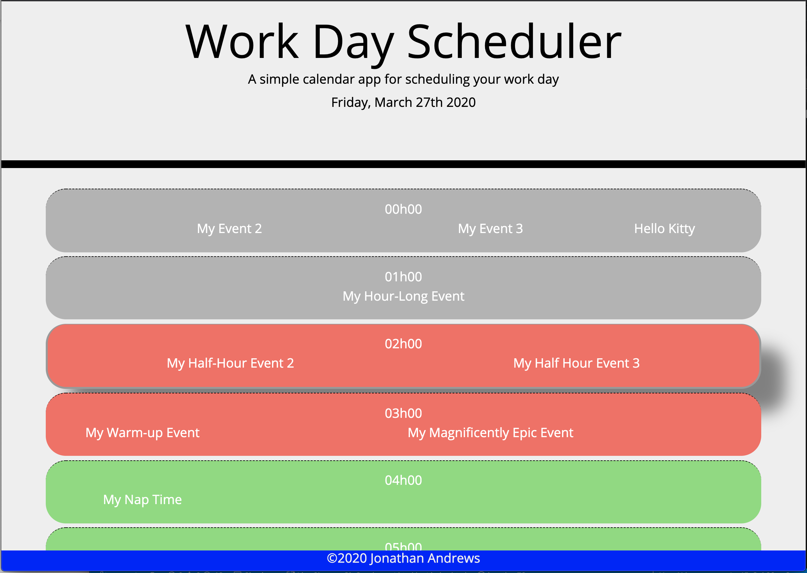
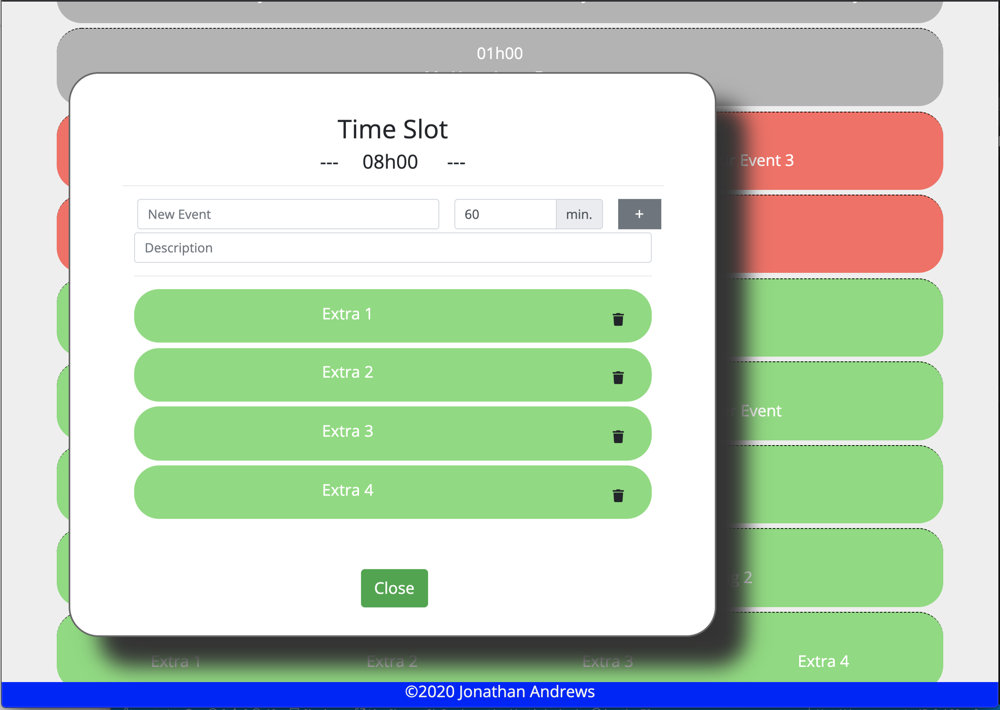

# 05 Third-Party APIs: Work Day Scheduler

> This web app lets the user create and store events in the same day.

There were a lot of features I would love to have added to this app for which I didn't have time, 
but it did turn out to be a good starting point if I ever want to add more. In particular, I would've 
loved to enable the user to edit events instead of just viewing and deleting them. I also really wanted 
to do overflows, where an event spilled over into the next hour. Finally, I wished I'd had time to let 
the user switch days and store them so ze could schedule events in the future.
Beyond that, it would've been nice to be able to push events to a Google calendar...

## User Story

```
AS AN employee with a busy schedule
I WANT to add important events to a daily planner
SO THAT I can manage my time effectively
```

## Design Imperatives

```
GIVEN I am using a daily planner to create a schedule
WHEN I open the planner
THEN the current day is displayed at the top of the calendar
WHEN I scroll down
THEN I am presented with timeblocks for standard business hours
WHEN I view the timeblocks for that day
THEN each timeblock is color coded to indicate whether it is in the past, present, or future
WHEN I click into a timeblock
THEN I can enter an event
WHEN I click the save button for that timeblock
THEN the text for that event is saved in local storage
WHEN I refresh the page
THEN the saved events persist
```

## Usage
When you pull up the form, you'll see today's schedule laid out in hourly blocks, with the hour 
printed at the top of the block and your scheduled events spelled out in the bottom half of the 
block. Blocks in the past are grey; blocks in the present or near future are red; blocks farther
than about an hour off are green.
Click or tap on a block to pull up the Events Form for that time slot. Here, you can add a new event,
review an existing event, or remove an event. Note that event durations are limited to multiples of 15--
sorry about that. You can finish an event either by pressing Return in one of the fields or by hitting 
the plus button on the right side of the form. To view the details on an existing event, click or tap it. 
Press the garbage icon on the right side to delete it. There'll be a confirmation prompt in case you 
tapped the wrong thing. Once you're done, hit the Close button to go back to the main screen.
Notice that there isn't any kind of Save button. That's because the page saves your data automatically
any time you leave the Event Form. Refresh the page if you want to test it out!

## Screen Shots



